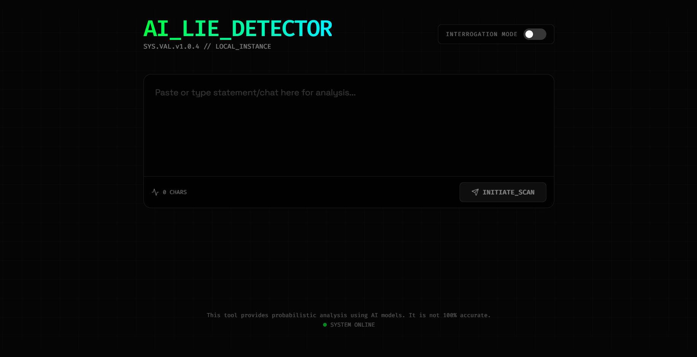
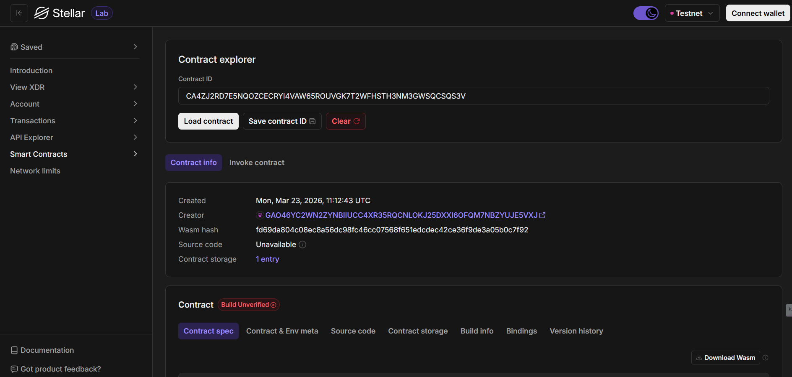

# LieDitecctor: AI-Powered Truth Verification 🕵️‍♂️

A fully functional, decentralized Web3 application built on the **Stellar Soroban** blockchain. This dApp allows users to securely verify statements using AI-driven lie detection, featuring a premium dark-themed frontend and an optimized Rust smart contract.

## Deployment Details

*   **Contract ID / Address:** `CAV6NCX6JY6DKYCKNTHDUOPJUQ3Y5YLSJKKGAXI5PPSMHMXPG3OH4KQH`
*   **Network:** Stellar Testnet
*   **Deployment Link:** `[Insert Deployment URL Here]` (e.g., Vercel / Netlify)

### Dashboard Preview



### On-Chain Verification



## Features ✨

*   **Non-Custodial Wallet Integration:** Securely connect and sign transactions using the [Freighter Browser Extension](https://www.freighter.app/).
*   **AI-Powered Verification:** Leverages Gemini AI to analyze statements for truthfulness before recording them on-chain.
*   **Live On-Chain Registry:** Record verified truths directly onto the Stellar blockchain with unique transaction hashes.
*   **Storage Optimized:** Utilizes Soroban's `Persistent` and `Instance` storage efficiently to manage verification history and global stats.
*   **Premium Interactive UI:** A beautiful, responsive frontend built with React, Vite, and Vanilla CSS, featuring glassmorphism and smooth animations.

## Project Architecture 🏗️

The project is divided into two main components:

1.  **Smart Contract (`/contracts/lie_detector`)**: Written in Rust using the Soroban SDK (v25). It handles core verification logic, truth recording, and emits events for off-chain tracking.
2.  **Frontend (`/frontend`)**: A React + Vite Web3 application written in TypeScript that interacts with the deployed contract on the Stellar Testnet and integrates Gemini AI.

---

## Getting Started 🚀

### Prerequisites

*   [Node.js](https://nodejs.org/) (v18+)
*   [Rust](https://www.rust-lang.org/) (v1.80+)
*   [Stellar CLI](https://developers.stellar.org/docs/build/smart-contracts/getting-started/setup)
*   [Freighter Wallet Extension](https://www.freighter.app/)

### 1. Smart Contract (Phase A)

The contract is already deployed, but if you wish to deploy it yourself using our automation:

1.  **Build and Optimize**:
    ```bash
    make build
    ```
2.  **Run Unit Tests**:
    ```bash
    make test
    ```
3.  **Deploy**:
    ```bash
    sh scripts/deploy.sh
    ```

### 2. Frontend Application (Phase B)

1.  Navigate to the frontend directory:
    ```bash
    cd frontend
    ```
2.  Install dependencies:
    ```bash
    npm install
    ```
3.  Start the development server:
    ```bash
    npm run dev
    ```
4.  Open `http://localhost:5173`.

### Connecting your Wallet
1.  Install the **Freighter extension**.
2.  Switch the network to **Testnet**.
3.  Fund your account via [Stellar laboratory Friendbot](https://laboratory.stellar.org/#account-creator?network=test).
4.  Click **CONNECT WALLET** in the LieDitecctor header.

## Automation & Scripts 📜

The root directory contains a `Makefile` and scripts to streamline the Soroban workflow:

*   `make build`: Compiles and optimizes the WASM contract.
*   `make test`: Runs all Rust unit tests for the smart contract.
*   `scripts/deploy.sh`: Builds, optimizes, and deploys the contract to Testnet, saving the `VITE_CONTRACT_ID` to `.env`.
*   `make clean`: Removes build artifacts and temporary logs.

---
Built with 🧡 on **Stellar Soroban**.
